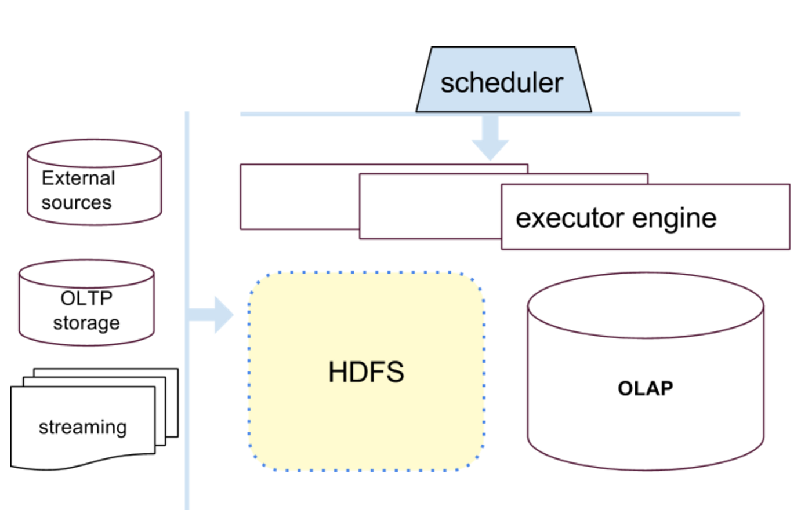

# Data Ecosystem
WhereHows is a data management system that lives in an enterprise data ecosystem.
A typical data ecosystem contains at least three parts:

1. storage systems
1. execution engines
1. workflow management systems

The original data can be gathered from online databases, external data sources, or some streaming systems such as Kafka/Storm. Inside the enterprise, people can massage the data to mine any value from it. This data will persist on either online data storage systems such as RDBMS, document databases, or be stored in offline storage systems such as HDFS. As the workflows scale up, most companies will use some workflow management system such as Azkaban or Oozie.

As this project started at LinkedIn, we started by supporting the systems that LinkedIn is using now.
* Analytics Storage system: HDFS, Teradata, Hive, Espresso, Kafka, Voldemort
* Execution: MapReduce, Pig, Hive, Teradata SQL.
* Workflow management: Azkaban, Appworx, Oozie

In enterprise data ecosystems, storage of data will be spread across storage systems, job execution will be spread across different execution engines and scheduled by different systems. We need a system to integrate all information together to make better use of our data.

# Use Cases
* Use case 1: Onboarding new people. WhereHows type of dataset is actually a good place to let new people get a complete view of how data is organized in the company.
* Use case 2: Find datasets. Many times when you have an idea, you know you need to use datasets, but don't know the exact information of the dataset. Using WhereHows, you can search from murky semantics for data and columns, and you'll find the locations, schemas, columns information, partitions, and sample data of the dataset. You can also view how other people are using them.
* Use case 3: Find the impacted Jobs/Data. For example, you are changing a dataset that you owned (maybe changing to a new location or removing columns), and you need to know who is consuming this dataset. Now you can use WhereHows lineage tracing function to find any jobs that are reading from this dataset. You can then notify them about your change.
